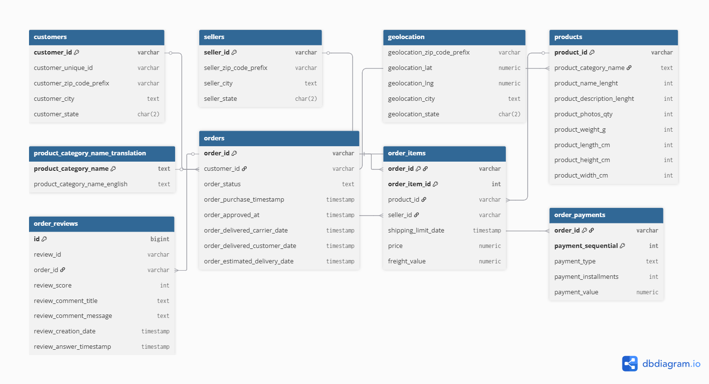

# 🌎 NovaCommerce Analytics — E-commerce Insights for Brazil

NovaCommerce — маркетплейс, который объединяет тысячи продавцов и миллионов покупателей по всей Бразилии. 

Мы помогаем мерчантам выходить к новой аудитории, а покупателям — получать широкий выбор, быструю доставку и удобные способы оплаты.

Роль аналитика: я работаю аналитиком в команде Revenue & Operations. Мои задачи:

- собирать и поддерживать витрины данных (PostgreSQL) под продуктовую и операционную аналитику;

- строить отчёты и дашборды (Apache Superset) по продажам, конверсиям, логистике и оплатам;

- находить точки роста: топ-категории, эффективность продавцов, узкие места доставки, паттерны оплат;

- отвечать на ad-hoc вопросы бизнеса SQL-запросами и Python-скриптами.

В качестве учебного корпоративного DWH используется открытый датасет Brazilian E-Commerce (Olist). На нём я показываю полный цикл: от схемы БД и загрузки до аналитики и дашбордов.


## Архитектура и стек

- База данных: PostgreSQL 16 (контейнер Docker, схема olist)

- Витрины/SQL: schema.sql, queries.sql

- Загрузка данных: load_olist.py (COPY из CSV), post_load.sql (добавляет недостающие категории и валидирует FK)

- BI/дашборды: Apache Superset (по желанию; скриншот в docs/dashboard.png)

- Аналитические выгрузки: main.py (Python + pandas/SQLAlchemy)

## ER-диаграмма




## Структура репозитория

```bash
NovaCommerce-Analytics/
├─ docker-compose.yml               # Postgres (и, при желании, Superset/pgAdmin)
├─ schema.sql                       # схема БД с PK/FK
├─ post_load.sql                    # дополнение словаря категорий + валидация FK
├─ load_olist.py                    # загрузка CSV → таблицы (COPY)
├─ queries.sql                      # 10 тем аналитики (SQL)
├─ main.py                          # Python: выполняет SQL и сохраняет CSV
├─ data/                            # CSV-файлы датасета Olist
│   ├─ olist_customers_dataset.csv
│   ├─ olist_geolocation_dataset.csv
│   ├─ olist_order_items_dataset.csv
│   ├─ olist_order_payments_dataset.csv
│   ├─ olist_order_reviews_dataset.csv
│   ├─ olist_orders_dataset.csv
│   ├─ olist_products_dataset.csv
│   ├─ olist_sellers_dataset.csv
│   └─ product_category_name_translation.csv
└─ docs/
    ├─ er.png                       # ER-диаграмма (DBeaver/dbdiagram)
    └─ dashboard.png                # скрин дашборда (Superset)
```

## Быстрый запуск (Windows/PowerShell)

***Требуется установленный Docker Desktop (WSL2) и Python 3.11+. Команды ниже – для PowerShell.***

### 1) Поднять PostgreSQL в Docker
```bash
docker compose up -d --build     
```

### 2) Проверки в pgAdmin/psql

pgAdmin:

Подключение: 
- Host 127.0.0.1
- Port 5433 
- DB e-commercedb 
- User postgres 
- Pass secret

***Найди Schemas → olist → Tables, открой данные через View/Edit Data.***


### 3) Выполнить базовые SQL и аналитики

Проверки по заданию:

```bash
-- LIMIT 10
SELECT * FROM olist.orders LIMIT 10;

-- WHERE + ORDER BY
SELECT order_id, order_status, order_purchase_timestamp
FROM olist.orders
WHERE order_status IN ('delivered','shipped')
ORDER BY order_purchase_timestamp DESC
LIMIT 10;

-- GROUP BY + COUNT/AVG/MIN/MAX
SELECT payment_type,
       COUNT(*) AS cnt,
       ROUND(AVG(payment_value),2) AS avg_payment,
       ROUND(MIN(payment_value),2) AS min_payment,
       ROUND(MAX(payment_value),2) AS max_payment
FROM olist.order_payments
GROUP BY payment_type
ORDER BY cnt DESC;

-- JOIN (orders + customers + order_items)
SELECT o.order_id, c.customer_state, ROUND(SUM(oi.price),2) AS order_sum
FROM olist.orders o
JOIN olist.customers c ON c.customer_id = o.customer_id
JOIN olist.order_items oi ON oi.order_id = o.order_id
GROUP BY o.order_id, c.customer_state
ORDER BY order_sum DESC
LIMIT 10;
```
### 4) Python-скрипт для выгрузок
```bash
pip install pandas SQLAlchemy psycopg2-binary
python .\main.py
```

***Скрипт выполнит 2–3 аналитических запроса, выведет первые строки в консоль и сохранит CSV рядом (top_categories_revenue.csv, payment_types_share.csv, …).***

---

### Next Step:
- Запускаем аналитические запросы (SQL).
- Строим визуализации (PNG графики, интерактивный time slider).
- Создаём Excel-отчёт с форматированием.

### 1)Запуск аналитики и построение графиков
```bash
python bar_chart.py
barh_chart.py
hist_chart.py
line_chart.py
pie_chart.py
scatter_chart.py
```

***Результат:***

📊 Папка charts/ с 6 графиками:

- pie_chart.png — доли выручки по категориям
- bar_chart.png — средний чек по штатам
- barh_chart.png — топ-продавцы по выручке
- line_chart.png — тренд выручки по месяцам
- hist_chart.png — распределение сумм заказов
- scatter_chart.png — связь скорости доставки и оценки

```bash
python export_exal.py
```
***Excel-файл exports/report_assignment2.xlsx с 3 листами:***

- top_categories
- aov_by_state
- monthly_revenue

### Time Slider
Запуск интерактивного слайдера по месяцам:
```bash
python time_slider_plotly.py
```

***Файл сохраняется как charts/time_slider.html.***
***Открой его в браузере, чтобы перемещаться по временной шкале.***

### 📦 Требования

***Установи пакеты (лучше в виртуальном окружении):***
```bash
pip install -r requirements.txt
```

или вручную:
```bash
pip install pandas sqlalchemy psycopg2-binary openpyxl plotly xlsxwriter matplotlib
```

### Script for first part 
- write in pgAdmin
```bash
-- 1. Добавляем покупателя
INSERT INTO customers (customer_id, customer_unique_id, customer_zip_code_prefix, customer_city, customer_state)
VALUES ('test_customer_001', 'unique_test_customer', '00000', 'TestCity', 'TS');

-- 2. Добавляем продавца
INSERT INTO sellers (seller_id, seller_zip_code_prefix, seller_city, seller_state)
VALUES ('test_seller_001', '00000', 'TestCity', 'TS');

-- 3. Добавляем продукт (категория toys)
INSERT INTO products (product_id, product_category_name, product_name_lenght,
                      product_description_lenght, product_photos_qty,
                      product_weight_g, product_length_cm, product_height_cm, product_width_cm)
VALUES ('test_product_001', 'toys', 10, 50, 1, 500, 10, 5, 5);

-- 4. Добавляем заказ (customer_id)
INSERT INTO orders (order_id, customer_id, order_status, order_purchase_timestamp,
                    order_approved_at, order_delivered_customer_date, order_estimated_delivery_date)
VALUES ('test_order_001', 'test_customer_001', 'delivered',
        NOW(), NOW(), NOW(), NOW() + INTERVAL '5 days');

-- 5. Добавляем товар в заказ
INSERT INTO order_items (order_id, order_item_id, product_id, seller_id, shipping_limit_date, price, freight_value)
VALUES ('test_order_001', 1, 'test_product_001', 'test_seller_001',
        NOW() + INTERVAL '2 days', 99999.99, 100.00);
```

- Code for delete this new data
```bash
-- 1. Удаляем из order_items (зависит от orders, products, sellers)
DELETE FROM order_items WHERE order_id = 'test_order_001';

-- 2. Удаляем заказ
DELETE FROM orders WHERE order_id = 'test_order_001';

-- 3. Удаляем продукт
DELETE FROM products WHERE product_id = 'test_product_001';

-- 4. Удаляем продавца
DELETE FROM sellers WHERE seller_id = 'test_seller_001';

-- 5. Удаляем покупателя
DELETE FROM customers WHERE customer_id = 'test_customer_001';
```

# Use Superset

***Auto refresh***
```bash
/script
python stream_inserts.py
```


***Student - Kuandyk Zhanel.***

***Group - IT-2303.***